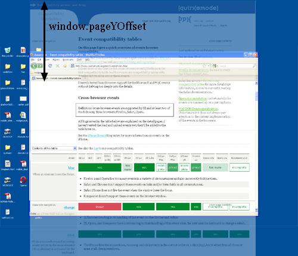
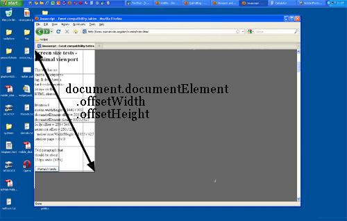
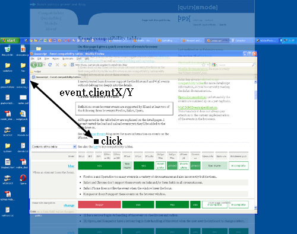

【A tale of two viewports 两个viewports的故事】

http://weizhifeng.net/viewports.html 参照译文，官方原文中文版  

http://www.quirksmode.org/mobile/viewports.html  原文1

http://www.quirksmode.org/mobile/viewports2.html 原文2  

    In this mini-series I will explain how viewports and the widths of various important elements work, such as the <html> element, as well as the window and the screen.

在这个迷你系列的文章里我将解释viewports以及许多重要的HTML标签元素的宽度是如何工作的，例如<html>元素，也包括窗口（window）和屏幕（screen）。

    This page is about the desktop browsers, and its sole purpose is to set the stage for a similar discussion of the mobile browsers. Most web developers will already intuitively understand most desktop concepts. On mobile we’ll find the same concepts, but more complicated, and a prior discussion on terms everybody already knows will greatly help your understanding of the mobile browsers.

这篇文章（第一部分）主要关于桌面浏览器的，其唯一的目的就是为移动浏览器中相似的讨论做个铺垫。大部分开发者凭直觉已经明白了大部分桌面浏览器中的概念。在移动端我们将会接触到相同的概念，但是会更加复杂，所以对大家已经知道的术语做个提前的讨论将会对你理解移动浏览器产生巨大的帮助（友好的预热）。

【Concept: device pixels and CSS pixels 概念：设备像素和CSS像素】

    The first concept you need to understand is CSS pixels, and the difference with device pixels.

你需要明白的第一个概念是CSS像素，以及它和设备像素的区别。

    Device pixels are the kind of pixels we intuitively assume to be “right.” These pixels give the formal resolution of whichever device you’re working on, and can (in general) be read out from screen.width/height.

设备像素是我们直觉上觉得「靠谱」的像素。这些像素为你所使用的各种设备都提供了正规的分辨率，并且其值可以（通常情况下）从screen.width/height属性中读出。

    If you give a certain element a width: 128px, and your monitor is 1024px wide, and you maximise your browser screen, the element would fit on your monitor eight times (roughly; let’s ignore the tricky bits for now).

如果你给一个元素设置了width: 128px的属性，并且你的显示器是1024px宽，当你最大化你的浏览器屏幕，这个元素将会在你的显示器上重复显示8次（大概是这样；我们先忽略那些微妙的地方）。

    If the user zooms, however, this calculation is going to change. If the user zooms to 200%, your element with width: 128px will fit only four times on his 1024px wide monitor.

如果用户进行缩放（zoom），那么计算方式将会发生变化。如果用户放大到200%，那么你的那个拥有width:128px属性的元素在1024px宽的显示器上只会重复显示4次。

    Zooming as implemented in modern browsers consists of nothing more than “stretching up” pixels. That is, the width of the element is not changed from 128 to 256 pixels; instead the actual pixels are doubled in size. Formally, the element still has a width of 128 CSS pixels, even though it happens to take the space of 256 device pixels.

现代浏览器中实现缩放的方式无怪乎都是「拉伸」像素。所以，元素的宽度并没有从128个像素被修改为256个像素；相反是实际像素被放大了两倍。形式上，元素仍然是128个CSS像素宽，即使它占据了256个设备像素的空间。

    In other words, zooming to 200% makes one CSS pixel grow to four times the size of one device pixels. (Two times the width, two times the height, yields four times in total).

换句话说，放大到200%使一个CSS像素变成为一个设备像素的四倍。（宽度2倍，高度2倍，总共4倍）

    A few images will clarify the concept. Here are four pixels on 100% zoom level. Nothing much to see here; CSS pixels fully overlap with device pixels.

一些配图可以解释清楚这个概念。这儿有四个100%缩放比的元素。这儿没有什么值得看的；CSS像素与设备像素完全重叠。


    Now let’s zoom out. The CSS pixels start to shrink, meaning that one device pixel now overlaps several CSS pixels.

现在让我们缩小。CSS像素开始收缩，这意味着现在一个设备像素覆盖了多个CSS像素。


    If you zoom in, the opposite happens. The CSS pixels start to grow, and now one CSS pixels overlaps several device pixels.

如果你进行放大，相反的行为会发生。CSS像素开始变大，现在一个CSS像素覆盖了多个设备像素。


    The point here is that you are only interested in CSS pixels. It’s those pixels that dictate how your style sheet is rendered.

这儿的要点是你只对CSS像素感兴趣。这些就是那些控制你的样式表如何被渲染的像素。

    Device pixels are almost entirely useless to you. Not to the user; the user will zoom the page in or out until he can comfortably read it. However, that zooming level doesn’t matter to you. The browser will automatically make sure that your CSS layout is stretched up or squeezed in.

设备像素对你（译者：指的是开发者）来说基本上没用。但是对于用户不一样；用户将会放大或者缩小页面直到他能舒服的阅读为止。无论怎样，缩放比例对你不会产生影响。浏览器将会自动的使你的CSS布局被拉伸或者被压缩。


【100% zoom 100% 缩放】

    I started the example by assuming a zoom level of 100%. It’s time to define that slightly more strictly:
        
        At zoom level 100% one CSS pixel is exactly equal to one device pixel.

我是以假设缩放比例为100%来开始这个例子的。是时候需要更加严格的来定义一下这个100%了：

    在缩放比例100%的情况下一个CSS像素完全等于一个设备像素。

The concept of 100% zoom is very useful in the explanations that are going to follow, but you shouldn’t overly worry about it in your daily work. On desktop you will generally test your sites in 100% zoom, but even if the user zooms in or out the magic of CSS pixels will make sure that your layout retains the same ratios.

100%缩放的概念在接下来的解释中会非常有用，但是在你的日常工作中你不用过分的担心它。在桌面环境上你将会在100%缩放比例的情况下测试你的站点，但即使用户放大或者缩小，CSS像素的魔力将会保证你的布局保持相同的比率。

【Screen size 屏幕尺寸】

screen.width/height
* Meaning:Total size of the user’s screen.
* Measured in:Device pixels
* Browser errors:IE8 measures it in CSS pixels, in both IE7 and IE8 mode.

screen.width/height
* 含义：用户屏幕的整体大小。。
* 度量单位：设备像素。
* 兼容性问题：IE8以CSS像素对其进行度量，IE7和IE8模式下都有这个问题。


    Let’s take a look at some practical measurements. We’ll start with screen.width and screen.height. They contain the total width and height of the user’s screen. These dimensions are measured in device pixels because they never change: they’re a feature of the monitor, and not of the browser.

让我们看一些实用的度量。我们将会以screen.width和screen.height做为开始。它们包括用户屏幕的整个宽度和高度。它们的尺寸是以设备像素来进行度量的，因为它们永远不会变：它们是显示器的属性，而不是浏览器的。


    Fun! But what do we do with this information?

Fun! 但是这些信息跟对我们有什么用呢？

    Basically, nothing. The user’s monitor size is unimportant to us — well, unless you want to measure it for use in a web statistics database.

基本上没用。用户的显示器尺寸对于我们来说不重要－好吧，除非你想度量它来丰富你的web统计数据库。

【Window size 窗口尺寸】

window.innerWidth/Height
* Meaning:Total size of the browser window, including scrollbars.
* Measured in:CSS pixels
* Browser errors:Not supported by IE.
    * Opera measures it in device pixels.

window.innerWidth/Height

* 含义：浏览器窗口的整体大小，包括滚动条。
* 度量单位：CSS像素。
* 兼容性问题：IE7不支持。Opera以设备像素进行度量。


    Instead, what you want to know is the inner dimensions of the browser window. That tells you exactly how much space the user currently has available for your CSS layout. You can find these dimensions in window.innerWidth and window.innerHeight.

相反，你想知道的是浏览器窗口的内部尺寸。它告诉了你用户到底有多少空间可以用来做CSS布局。你可以通过window.innerWidth和window.innerHeight来获取这些尺寸。


    Obviously, the inner width of the window is measured in CSS pixels. You need to know how much of your layout you can squeeze into the browser window, and that amount decreases as the user zooms in. So if the user zooms in you get less available space in the window, and window.innerWidth/Height reflect that by decreasing.
    
很显然，窗口的内部宽度是以CSS像素进行度量的。你需要知道你的布局空间中有多少可以挤进浏览器窗口，当用户放大的时候这个数值会减少。所以如果用户进行放大操作，那么在窗口中你能获取的空间将会变少，window.innerWidth/Height的值也变小了。

    (The exception here is Opera, where window.innerWidth/Height do not decrease when the user zooms in: they’re measured in device pixels. This is annoying on desktop, but fatal on mobile, as we’ll see later.)

（这儿的例外是Opera，当用户放大的时候window.innerWidth/Height并没有减少：它们是以设备像素进行度量的。这个问题在桌面上是比较烦人的，但是就像我们将要看到的，这在移动设备上却是非常严重的。）


    Note that the measured widths and heights include the scrollbars. They, too, are considered part of the inner window. (This is mostly for historical reasons.)

注意，窗口内部宽度和高度的尺寸，包含了滚动条的尺寸。（这主要是来至于历史原因）

【Scrolling offset 滚动距离】

window.pageX/YOffset
* Meaning:Scrolling offset of the page.
* Measured in:CSS pixels
* Browser errors:None

window.pageX/YOffset
* 含义：页面滚动的距离。
* 度量单位：CSS像素。
* 兼容性问题：pageXOffset 和 pageYOffset 在 IE 8 及之前版本的IE不支持, 使用”document.body.scrollLeft” and “document.body.scrollTop” 来取代

    

    window.pageXOffset and window.pageYOffset, contain the horizontal and vertical scrolling offsets of the document. Thus you can find out how much the user has scrolled.

window.pageXOffset和window.pageYOffset，包含了文档水平和垂直方向的滚动距离。所以你可以知道用户已经滚动了多少距离。



    These properties are measured in CSS pixels, too. You want to know how much of the document has already been scrolled up, whatever zoom state it’s in.

这些属性也是以CSS像素进行度量的。你想知道的是文档已经被滚动了多长距离，不管它是放大还是缩小的状态。

    In theory, if the user scrolls up and then zooms in, window.pageX/YOffset will change. However, the browsers try to keep web pages consistent by keeping the same element at the top of the visible page when the user zooms. That doesn’t always work perfectly, but it means that in practice window.pageX/YOffset doesn’t really change: the number of CSS pixels that have been scrolled out of the window remains (roughly) the same.

理论上，如果用户向上滚动，然后放大，window.pageX/YOffset将会发生变化。但是，浏览器为了想保持web页面的连贯，会在用户缩放的时候保持相同的元素位于可见页面的顶部。这个机制并不能一直很完美的执行，但是它意味着在实际情况下window.pageX/YOffset并没有真正的更改：被滚动出窗口的CSS像素的数量仍然（大概）是相同的。


【Concept: the viewport 概念：viewport】

    Before we continue with more JavaScript properties we have to introduce another concept: the viewport.

在我们继续介绍更多的JavaScript属性之前，我们必须介绍另一个概念：viewport。

    The function of the viewport is to constrain the <html> element, which is the uppermost containing block of your site.

viewport的功能是用来约束你网站中最顶级包含块元素（containing block）<html>的。

    That may sound a bit vague, so here’s a practical example. Suppose you have a liquid layout and one of your sidebars has width: 10%. Now the sidebar neatly grows and shrinks as you resize the browser window. But exactly how does that work?

这听起来有一点模糊，所以看一个实际的例子。假设你有一个流式布局，并且你众多边栏中的一个具有width:10%属性。现在这个边栏会随着浏览器窗口大小的调整而恰好的放大和收缩。但是这到底是如何工作的呢？

    Technically, what happens is that the sidebar gets 10% of the width of its parent. Let’s say that’s the <body> (and that you haven’t given it a width). So the question becomes which width the <body> has.

从技术上来说，发生的事情是边栏获取了它父元素宽度的10%。比方说是<body>元素（并且你还没有给它设置过宽度）。所以问题就变成了<body>的宽度是哪个？

    Normally, all block-level elements take 100% of the width of their parent (there are exceptions, but let’s ignore them for now). So the <body> is as wide as its parent, the <html> element.

普通情况下，所有块级元素使用它们父元素宽度的100%（这儿有一些例外，但是让我们现在先忽略它）。所以<body>元素和它的父元素<html>一样宽。

    And how wide is the <html> element? Why, it’s as wide as the browser window. That’s why your sidebar with width: 10% will span 10% of the entire browser window. All web developers intuitively know and use this fact.
    
那么<html>元素的宽度是多少？它的宽度和浏览器窗口宽度一样。这就是为什么你的那个拥有width:10%属性的侧边栏会占据整个浏览器窗口的10%。所有web开发者都很直观的知道并且在使用它。

    What you may not know is how this works in theory. In theory, the width of the <html> element is restricted by the width of the viewport. The <html> element takes 100% of the width of that viewport.

你可能不知道的是这个行为在理论上是如何工作的。理论上，<html>元素的宽度是被viewport的宽度所限制的。<html>元素使用viewport宽度的100%。

    The viewport, in turn, is exactly equal to the browser window: it’s been defined as such. The viewport is not an HTML construct, so you cannot influence it by CSS. It just has the width and height of the browser window — on desktop. On mobile it’s quite a bit more complicated.

viewport，接着，实际上等于浏览器窗口：它就是那么定义的。viewport不是一个HTML结构，所以你不能用CSS来改变它。它在桌面环境下只是拥有浏览器窗口的宽度和高度。在移动环境下它会有一些复杂。

【Consequences 后果】

    This state of affairs has some curious consequences. You can see one of them right here on this site. Scroll all the way up to the top, and zoom in two or three steps so that the content of this site spills out of the browser window.
    
这个状况会有产生一些异样的后果。你可以在这个站点看到这些后果中的一个。滚动到顶部，然后放大两次或者三次，之后这个站点的内容就从浏览器窗口溢出了。

    Now scroll to the right, and you’ll see that the blue bar at the top of the site doesn’t line up properly any more.

现在滚动到右边，然后你将会看见站点顶部的蓝色边栏不再覆盖一整行了。


    This behaviour is a consequence of how the viewport is defined. I gave the blue bar at the top a width: 100%. 100% of what? Of the <html> element, which is as wide as the viewport, which is as wide as the browser window.

这个行为是由于viewport的定义方式而产生的一个后果。我之前给顶部的蓝色边栏设置了width:100%。什么的100%？<html>元素的100%，它的宽度和viewport是一样的，viewport的宽度是和浏览器窗口一样的。

    Point is: while this works fine at 100% zoom, now that we’ve zoomed in the viewport has become smaller than the total width of my site. In itself that doesn’t matter, the content now spills out of the <html> element, but that element has overflow: visible, which means that the spilled-out content will be shown in any case.
    
问题是：在100%缩放的情况下这个工作的很好，现在我们进行了放大操作，viewport变得比我的站点的总体宽度要小。这对于viewport它本身来说没什么影响，内容现在从<html>元素中溢出了，但是那个元素拥有overflow: visible，这意味着溢出的内容在任何情况下都将会被显示出来。

    But the blue bar doesn’t spill out. I gave it a width: 100%, after all, and the browsers obey by giving it the width of the viewport. They don’t care that that width is now too narrow.

但是蓝色边栏并没有溢出。我之前给它设置了width: 100%，并且浏览器把viewport的宽度赋给了它。它们根本就不在乎现在宽度实在是太窄了。


【document width? 页面宽度?】

    What I really need to know is how wide the total content of the page is, including the bits that “stick out.” As far as I know it’s not possible to find that value (well, unless you calculate the individual widths and margins of all elements on the page, but that’s error-prone, to put it mildly).

我真正需要知道的是页面中全部内容的宽度是多少，包括那些「伸出」的部分。据我所知得到这个值是不可能的（好吧，除非你去计算页面上所有元素的宽度和边距，但是委婉的说，这是容易出错的）。

    I am starting to believe that we need a JavaScript property pair that gives what I’ll call the “document width” (in CSS pixels, obviously).

我开始相信我们需要一个我称其为「文档宽度」(document width，很显然用CSS像素进行度量)的JavaScript属性对。


    And if we’re really feeling funky, why not also expose this value to CSS? I’d love to be able to make the width: 100% of my blue bar dependent on the document width, and not the <html> element’s width. (This is bound to be tricky, though, and I wouldn’t be surprised if it’s impossible to implement.)
    
并且如果我们真的如此时髦，为什么不把这个值引入到CSS中？我将会给我的蓝色边栏设置width:100%，此值基于文档宽度，而不是<html>元素的宽度。（但是这个很复杂，并且如果不能实现我也不会感到惊讶。）

    Browser vendors, what do you think?

浏览器厂商们，你们怎么认为的？


【Measuring the viewport 度量viewport】

document. documentElement. clientWidth/Height
* Meaning:Viewport dimensions
* Measured in:CSS pixels
* Browser errors:None

document. documentElement. clientWidth/Height
* 意义：Viewport尺寸。
* 度量单位：CSS像素。
* 浏览器错误：无。
 


    You might want to know the dimensions of the viewport. They can be found in document.documentElement.clientWidth and -Height.

你可能想知道viewport的尺寸。它们可以通过document.documentElement.clientWidth和-Height得到。


    If you know your DOM, you know that document.documentElement is in fact the <html> element: the root element of any HTML document. However, the viewport is one level higher, so to speak; it’s the element that contains the <html> element. That might matter if you give the <html> element a width. (I don’t recommend that, by the way, but it’s possible.)

如果你了解DOM，你应该知道document.documentElement实际上指的是<html>元素：即任何HTML文档的根元素。可以说，viewport要比它更高一层；它是包含<html>元素的元素。如果你给<html>元素设置width属性，那么这将会产生影响。（我不推荐这么做，但是那是可行的。）

    In that situation document.documentElement.clientWidth and -Height still gives the dimensions of the viewport, and not of the <html> element. (This is a special rule that goes only for this element only for this property pair. In all other cases the actual width of the element is used.)

在那种情况下document.documentElement.clientWidth和-Height给出的仍然是viewport的尺寸，而不是<html>元素的。（这是一个特殊的规则，只对这个元素的这个属性对产生作用。在任何其他的情况下，使用的是元素的实际宽度。）


    So document.documentElement.clientWidth and -Height always gives the viewport dimensions, regardless of the dimensions of the <html> element.

所以document.documentElement.clientWidth和-Height一直代表的是viewport的尺寸，不管<html>元素的尺寸是多少。

【Two property pairs 两个属性对】

    But aren’t the dimensions of the viewport width also given by window.innerWidth/Height? Well, yes and no.

但是难道viewport宽度的尺寸也可以通过window.innerWidth/Height来提供吗？怎么说呢，模棱两可。

    There’s a formal difference between the two property pairs: document.documentElement.clientWidth and -Height doesn’t include the scrollbar, while window.innerWidth/Height does. That’s mostly a nitpick, though.

两个属性对之间存在着正式区别：document.documentElement.clientWidth和-Height并不包含滚动条，但是window.innerWidth/Height包含。这像是鸡蛋里挑骨头。

    The fact that we have two property pairs is a holdover from the Browser Wars. Back then Netscape only supported window.innerWidth/Height and IE only document.documentElement.clientWidth and -Height. Since then all other browsers started to support clientWidth/Height, but IE didn’t pick up window.innerWidth/Height.

事实上两个属性对的存在是浏览器战争的产物。当时Netscape只支持window.innerWidth/Height，IE只支持document.documentElement.clientWidth和Height。从那时起所有其他浏览器开始支持clientWidth/Height，但是IE没有支持window.innerWidth/Height。

    Having two property pairs available is a minor nuisance on desktop — but it turns out to be a blessing on mobile, as we’ll see.

在桌面环境上拥有两个属性对是有一些累赘的　－　但是就像我们将要看到的，在移动端这将会得到祝福。

【Measuring the <html> element 度量\<html>元素】

document. documentElement. offsetWidth/Height
* Meaning:Dimensions of the <html> element (and thus of the page).
* Measured in:CSS pixels
* Browser errors:IE measures the viewport, and not the <html> element.

document.documentElement.offsetWidth/Height
* 意义：元素（也就是页面）的尺寸。
* 度量单位：CSS像素。
* 浏览器错误：IE度量的是viewport，而不是元素。


    So clientWidth/Height gives the viewport dimensions in all cases. But where can we find the dimensions of the <html> element itself? They’re stored in document.documentElement.offsetWidth and -Height.

所以clientWidth/Height在所有情况下都提供viewport的尺寸。但是我们去哪里获取<html>元素本身的尺寸呢？它们存储在document.documentElement.offsetWidth和-Height之中。


    These properties truly give you access to the <html> element as a block-level element; if you set a width, offsetWidth will reflect it.
  
这些属性可以使你以块级元素的形式访问<html>元素；如果你设置width，那么offsetWidth将会表示它。




【Event coordinates 事件中的坐标】

pageX/Y, clientX/Y, screenX/Y
* Meaning:see main text
* Measured in:see main text
* Browser errors:IE doesn’t support pageX/Y.IE and Opera calculate screenX/Y in CSS pixels.

pageX/Y, clientX/Y, screenX/Y
* 意义：见正文。
* 度量单位：见正文。
* 浏览器错误：IE不支持pageX/Y。IE和Opera以CSS像素为单位计算screenX/Y。


    Then there are the event coordinates. When a mouse event occurs, no less than five property pairs are exposed to give you information about the exact place of the event. For our discussion three of them are important:
    1. pageX/Y gives the coordinates relative to the <html> element in CSS pixels.
    2. clientX/Y gives the coordinates relative to the viewport in CSS pixels.
    3. screenX/Y gives the coordinates relative to the screen in device pixels.
    
然后是事件中的坐标。当一个鼠标事件发生时，有不少于五种属性对可以给你提供关于事件位置的信息。对于我们当前的讨论来说它们当中的三种是重要的：

pageX/Y提供了相对于<html>元素的以CSS像素度量的坐标。


clientX/Y提供了相对于viewport的以CSS像素度量的坐标。



screenX/Y提供了相对于屏幕的以设备像素进行度量的坐标。


    You’ll use pageX/Y 90% of the time; usually you want to know the event position relative to the document. The other 10% of the time you’ll use clientX/Y. You never ever need to know the event coordinates relative to the screen.
    
90%的时间你将会使用pageX/Y；通常情况下你想知道的是相对于文档的事件坐标。其他的10%时间你将会使用clientX/Y。你永远不需要知道事件相对于屏幕的坐标。

【Media queries 媒体查询】

Media queries
* Meaning:see main text
* Measured in:see main text
* Browser errors:IE doesn’t support them.
    * For device-width/height Firefox uses the values screen.width/height would have if they are measured in CSS pixels.
    * For width/height Safari and Chrome use the values documentElement .clientWidth/Height would have if they are measured in device pixels.

Media queries
* 意义：见正文。
* 度量单位：见正文。
* 浏览器错误：IE不支持它们。
    * 如果 device-width/height是以CSS像素进行度量的，那么Firefox将会使用screen.width/height的值。
    * 如果width/height是以设备像素进行度量的，那么Safari和Chrome将会使用documentElement.clientWidth/Height的值。
    


    Finally, some words about media queries. The idea is very simple: you can define special CSS rules that are executed only if the width of the page is larger than, equal to, or smaller than a certain size. For instance:
```
div.sidebar {
    width: 300px;
}

@media all and (max-width: 400px) {
    // styles assigned when width is smaller than 400px;
    div.sidebar {
        width: 100px;
    }

}
```

最后，说说关于媒体查询的事。原理很简单：你可以声明「只在页面宽度大于，等于或者小于一个特定尺寸的时候才会被执行」的特殊的CSS规则。比如：
```
div.sidebar {
    width: 300px;
}

@media all and (max-width: 400px) {
    // styles assigned when width is smaller than 400px;
    div.sidebar {
        width: 100px;
    }

}
```

    Now the sidebar is 300px wide, except when the width is smaller than 400px, in which case the sidebar becomes 100px wide.

当前sidebar是300px宽，除了当宽度小于400px的时候，在那种情况下sidebar变得100px宽。

    The question is of course: which width are we measuring here?

问题很显然：我们这儿度量的是哪个宽度？

    There are two relevant media queries: width/height and device-width/device-height.
    1. width/height uses the same values as documentElement .clientWidth/Height (the viewport, in other words). It works with CSS pixels.
    2. device-width/device-height uses the same values as screen.width/height (the screen, in other words). It works with device pixels.


这儿有两个对应的媒体查询：width/height和device-width/device-height。
1. width/height使用和documentElement .clientWidth/Height（换句话说就是viewport宽高）一样的值。它是工作在CSS像素下的。
2. device-width/device-height使用和screen.width/height（换句话说就是屏幕的宽高）一样的值。它工作在设备像素下面。


    Which should you use? That’s a no-brainer: width, of course. Web developers are not interested in the device width; it’s the width of the browser window that counts.
    
你应该使用哪个？这还用想？当然是width。Web开发者对设备宽度不感兴趣；这个是浏览器窗口的宽度。

    So use width and forget device-width — on desktop. As we’ll see, the situation is much more messy on mobile.

所以在桌面环境下去使用width而去忘记device-width吧。我们即将看到这个情况在移动端会更加麻烦。


【Conclusion 总结】

    That concludes our foray into the desktop browsers’ behaviour. The second part of this series ports these concepts to mobile and highlights some important differences with the desktop.

本文总结了我们对桌面浏览器行为的探寻。这个系列的第二部分把这些概念指向了移动端，并显示的指出了与桌面环境上的一些重要区别。


