前言
------

    A tale of two viewports 两个viewports的故事

http://weizhifeng.net/viewports.html  参照译文1，官方原文中文版  

http://weizhifeng.net/viewports1.html 参照译文2，官方原文中文版  

http://www.quirksmode.org/mobile/viewports.html  原文1

http://www.quirksmode.org/mobile/viewports2.html 原文2  

两个viewport的故事第一部分
---------------------------

    In this mini-series I will explain how viewports and the widths of various important elements work, such as the <html> element, as well as the window and the screen.

在这个迷你系列的文章里我将解释viewports以及许多重要的HTML标签元素的宽度是如何工作的，例如html元素，也包括窗口window和屏幕screen。

    This page is about the desktop browsers, and its sole purpose is to set the stage for a similar discussion of the mobile browsers. Most web developers will already intuitively understand most desktop concepts. On mobile we’ll find the same concepts, but more complicated, and a prior discussion on terms everybody already knows will greatly help your understanding of the mobile browsers.

这篇文章第一部分主要关于桌面浏览器的，其唯一的目的就是为移动浏览器中相似的讨论做个铺垫。大部分开发者凭直觉已经明白了大部分桌面浏览器中的概念。在移动端我们将会接触到相同的概念，但是会更加复杂，所以对大家已经知道的术语做个提前的讨论将会对你理解移动浏览器产生巨大的帮助（友好的预热）。

**Concept: device pixels and CSS pixels 概念：设备像素和CSS像素**

    The first concept you need to understand is CSS pixels, and the difference with device pixels.

你需要明白的第一个概念是CSS像素，以及它和设备像素的区别。

    Device pixels are the kind of pixels we intuitively assume to be “right.” These pixels give the formal resolution of whichever device you’re working on, and can (in general) be read out from screen.width/height.

设备像素是我们直觉上觉得「靠谱」的像素。这些像素为你所使用的各种设备都提供了正规的分辨率，并且其值可以（通常情况下）从screen.width/height属性中读出。

    If you give a certain element a width: 128px, and your monitor is 1024px wide, and you maximise your browser screen, the element would fit on your monitor eight times (roughly; let’s ignore the tricky bits for now).

如果你给一个元素设置了width: 128px的属性，并且你的显示器是1024px宽，当你最大化你的浏览器屏幕，这个元素将会在你的显示器上重复显示8次（大概是这样；我们先忽略那些微妙的地方）。

    If the user zooms, however, this calculation is going to change. If the user zooms to 200%, your element with width: 128px will fit only four times on his 1024px wide monitor.

如果用户进行缩放（zoom），那么计算方式将会发生变化。如果用户放大到200%，那么你的那个拥有width:128px属性的元素在1024px宽的显示器上只会重复显示4次。

    Zooming as implemented in modern browsers consists of nothing more than “stretching up” pixels. That is, the width of the element is not changed from 128 to 256 pixels; instead the actual pixels are doubled in size. Formally, the element still has a width of 128 CSS pixels, even though it happens to take the space of 256 device pixels.

现代浏览器中实现缩放的方式无怪乎都是「拉伸」像素。所以，元素的宽度并没有从128个像素被修改为256个像素；相反是实际像素被放大了两倍。形式上，元素仍然是128个CSS像素宽，即使它占据了256个设备像素的空间。

    In other words, zooming to 200% makes one CSS pixel grow to four times the size of one device pixels. (Two times the width, two times the height, yields four times in total).

换句话说，放大到200%使一个CSS像素变成为一个设备像素的四倍。（宽度2倍，高度2倍，总共4倍）

    A few images will clarify the concept. Here are four pixels on 100% zoom level. Nothing much to see here; CSS pixels fully overlap with device pixels.

一些配图可以解释清楚这个概念。这儿有四个100%缩放比的元素。这儿没有什么值得看的；CSS像素与设备像素完全重叠。


    Now let’s zoom out. The CSS pixels start to shrink, meaning that one device pixel now overlaps several CSS pixels.

现在让我们缩小。CSS像素开始收缩，这意味着现在一个设备像素覆盖了多个CSS像素。


    If you zoom in, the opposite happens. The CSS pixels start to grow, and now one CSS pixels overlaps several device pixels.

如果你进行放大，相反的行为会发生。CSS像素开始变大，现在一个CSS像素覆盖了多个设备像素。


    The point here is that you are only interested in CSS pixels. It’s those pixels that dictate how your style sheet is rendered.

这儿的要点是你只对CSS像素感兴趣。这些就是那些控制你的样式表如何被渲染的像素。

    Device pixels are almost entirely useless to you. Not to the user; the user will zoom the page in or out until he can comfortably read it. However, that zooming level doesn’t matter to you. The browser will automatically make sure that your CSS layout is stretched up or squeezed in.

设备像素对你（译者：指的是开发者）来说基本上没用。但是对于用户不一样；用户将会放大或者缩小页面直到他能舒服的阅读为止。无论怎样，缩放比例对你不会产生影响。浏览器将会自动的使你的CSS布局被拉伸或者被压缩。


**100% zoom 100% 缩放**

    I started the example by assuming a zoom level of 100%. It’s time to define that slightly more strictly:At zoom level 100% one CSS pixel is exactly equal to one device pixel.

我是以假设缩放比例为100%来开始这个例子的。是时候需要更加严格的来定义一下这个100%了：在缩放比例100%的情况下一个CSS像素完全等于一个设备像素。

    The concept of 100% zoom is very useful in the explanations that are going to follow, but you shouldn’t overly worry about it in your daily work. On desktop you will generally test your sites in 100% zoom, but even if the user zooms in or out the magic of CSS pixels will make sure that your layout retains the same ratios.


100%缩放的概念在接下来的解释中会非常有用，但是在你的日常工作中你不用过分的担心它。在桌面环境上你将会在100%缩放比例的情况下测试你的站点，但即使用户放大或者缩小，CSS像素的魔力将会保证你的布局保持相同的比率。

**Screen size 屏幕尺寸**

```
screen.width/height
* Meaning:Total size of the user’s screen.
* Measured in:Device pixels
* Browser errors:IE8 measures it in CSS pixels, in both IE7 and IE8 mode.
```

screen.width/height
* 含义：用户屏幕的整体大小。。
* 度量单位：设备像素。
* 兼容性问题：IE8以CSS像素对其进行度量，IE7和IE8模式下都有这个问题。


    Let’s take a look at some practical measurements. We’ll start with screen.width and screen.height. They contain the total width and height of the user’s screen. These dimensions are measured in device pixels because they never change: they’re a feature of the monitor, and not of the browser.

让我们看一些实用的度量。我们将会以screen.width和screen.height做为开始。它们包括用户屏幕的整个宽度和高度。它们的尺寸是以设备像素来进行度量的，因为它们永远不会变：它们是显示器的属性，而不是浏览器的。


    Fun! But what do we do with this information?

Fun! 但是这些信息跟对我们有什么用呢？

    Basically, nothing. The user’s monitor size is unimportant to us — well, unless you want to measure it for use in a web statistics database.

基本上没用。用户的显示器尺寸对于我们来说不重要－好吧，除非你想度量它来丰富你的web统计数据库。

**Window size 窗口尺寸**

```
window.innerWidth/Height
* Meaning:Total size of the browser window, including scrollbars.
* Measured in:CSS pixels
* Browser errors:Not supported by IE.
    * Opera measures it in device pixels.
```

window.innerWidth/Height
* 含义：浏览器窗口的整体大小，包括滚动条。
* 度量单位：CSS像素。
* 兼容性问题：IE7不支持。Opera以设备像素进行度量。


    Instead, what you want to know is the inner dimensions of the browser window. That tells you exactly how much space the user currently has available for your CSS layout. You can find these dimensions in window.innerWidth and window.innerHeight.

相反，你想知道的是浏览器窗口的内部尺寸。它告诉了你用户到底有多少空间可以用来做CSS布局。你可以通过window.innerWidth和window.innerHeight来获取这些尺寸。


    Obviously, the inner width of the window is measured in CSS pixels. You need to know how much of your layout you can squeeze into the browser window, and that amount decreases as the user zooms in. So if the user zooms in you get less available space in the window, and window.innerWidth/Height reflect that by decreasing.
    
很显然，窗口的内部宽度是以CSS像素进行度量的。你需要知道你的布局空间中有多少可以挤进浏览器窗口，当用户放大的时候这个数值会减少。所以如果用户进行放大操作，那么在窗口中你能获取的空间将会变少，window.innerWidth/Height的值也变小了。

    (The exception here is Opera, where window.innerWidth/Height do not decrease when the user zooms in: they’re measured in device pixels. This is annoying on desktop, but fatal on mobile, as we’ll see later.)

（这儿的例外是Opera，当用户放大的时候window.innerWidth/Height并没有减少：它们是以设备像素进行度量的。这个问题在桌面上是比较烦人的，但是就像我们将要看到的，这在移动设备上却是非常严重的。）


    Note that the measured widths and heights include the scrollbars. They, too, are considered part of the inner window. (This is mostly for historical reasons.)

注意，窗口内部宽度和高度的尺寸，包含了滚动条的尺寸。（这主要是来至于历史原因）

**Scrolling offset 滚动距离**

```
window.pageX/YOffset
* Meaning:Scrolling offset of the page.
* Measured in:CSS pixels
* Browser errors:None
```

window.pageX/YOffset
* 含义：页面滚动的距离。
* 度量单位：CSS像素。
* 兼容性问题：pageXOffset 和 pageYOffset 在 IE 8 及之前版本的IE不支持, 使用”document.body.scrollLeft” and “document.body.scrollTop” 来取代


    window.pageXOffset and window.pageYOffset, contain the horizontal and vertical scrolling offsets of the document. Thus you can find out how much the user has scrolled.

window.pageXOffset和window.pageYOffset，包含了文档水平和垂直方向的滚动距离。所以你可以知道用户已经滚动了多少距离。


    These properties are measured in CSS pixels, too. You want to know how much of the document has already been scrolled up, whatever zoom state it’s in.

这些属性也是以CSS像素进行度量的。你想知道的是文档已经被滚动了多长距离，不管它是放大还是缩小的状态。

    In theory, if the user scrolls up and then zooms in, window.pageX/YOffset will change. However, the browsers try to keep web pages consistent by keeping the same element at the top of the visible page when the user zooms. That doesn’t always work perfectly, but it means that in practice window.pageX/YOffset doesn’t really change: the number of CSS pixels that have been scrolled out of the window remains (roughly) the same.

理论上，如果用户向上滚动，然后放大，window.pageX/YOffset将会发生变化。但是，浏览器为了想保持web页面的连贯，会在用户缩放的时候保持相同的元素位于可见页面的顶部。这个机制并不能一直很完美的执行，但是它意味着在实际情况下window.pageX/YOffset并没有真正的更改：被滚动出窗口的CSS像素的数量仍然（大概）是相同的。

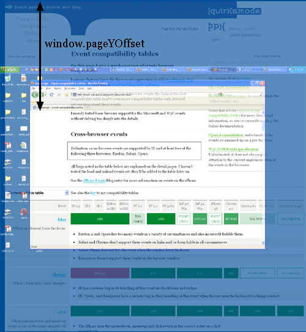

**Concept: the viewport 概念：viewport**

    Before we continue with more JavaScript properties we have to introduce another concept: the viewport.

在我们继续介绍更多的JavaScript属性之前，我们必须介绍另一个概念：viewport。

    The function of the viewport is to constrain the <html> element, which is the uppermost containing block of your site.

viewport的功能是用来约束你网站中最顶级包含块元素（containing block）<html>的。

    That may sound a bit vague, so here’s a practical example. Suppose you have a liquid layout and one of your sidebars has width: 10%. Now the sidebar neatly grows and shrinks as you resize the browser window. But exactly how does that work?

这听起来有一点模糊，所以看一个实际的例子。假设你有一个流式布局，并且你众多边栏中的一个具有width:10%属性。现在这个边栏会随着浏览器窗口大小的调整而恰好的放大和收缩。但是这到底是如何工作的呢？

    Technically, what happens is that the sidebar gets 10% of the width of its parent. Let’s say that’s the <body> (and that you haven’t given it a width). So the question becomes which width the <body> has.

从技术上来说，发生的事情是边栏获取了它父元素宽度的10%。比方说是<body>元素（并且你还没有给它设置过宽度）。所以问题就变成了<body>的宽度是哪个？

    Normally, all block-level elements take 100% of the width of their parent (there are exceptions, but let’s ignore them for now). So the <body> is as wide as its parent, the <html> element.

普通情况下，所有块级元素使用它们父元素宽度的100%（这儿有一些例外，但是让我们现在先忽略它）。所以<body>元素和它的父元素<html>一样宽。

    And how wide is the <html> element? Why, it’s as wide as the browser window. That’s why your sidebar with width: 10% will span 10% of the entire browser window. All web developers intuitively know and use this fact.
    
那么<html>元素的宽度是多少？它的宽度和浏览器窗口宽度一样。这就是为什么你的那个拥有width:10%属性的侧边栏会占据整个浏览器窗口的10%。所有web开发者都很直观的知道并且在使用它。

    What you may not know is how this works in theory. In theory, the width of the <html> element is restricted by the width of the viewport. The <html> element takes 100% of the width of that viewport.

你可能不知道的是这个行为在理论上是如何工作的。理论上，<html>元素的宽度是被viewport的宽度所限制的。<html>元素使用viewport宽度的100%。

    The viewport, in turn, is exactly equal to the browser window: it’s been defined as such. The viewport is not an HTML construct, so you cannot influence it by CSS. It just has the width and height of the browser window — on desktop. On mobile it’s quite a bit more complicated.

viewport，接着，实际上等于浏览器窗口：它就是那么定义的。viewport不是一个HTML结构，所以你不能用CSS来改变它。它在桌面环境下只是拥有浏览器窗口的宽度和高度。在移动环境下它会有一些复杂。

**Consequences 后果**

    This state of affairs has some curious consequences. You can see one of them right here on this site. Scroll all the way up to the top, and zoom in two or three steps so that the content of this site spills out of the browser window.
    
这个状况会有产生一些异样的后果。你可以在这个站点看到这些后果中的一个。滚动到顶部，然后放大两次或者三次，之后这个站点的内容就从浏览器窗口溢出了。

    Now scroll to the right, and you’ll see that the blue bar at the top of the site doesn’t line up properly any more.

现在滚动到右边，然后你将会看见站点顶部的蓝色边栏不再覆盖一整行了。


    This behaviour is a consequence of how the viewport is defined. I gave the blue bar at the top a width: 100%. 100% of what? Of the <html> element, which is as wide as the viewport, which is as wide as the browser window.

这个行为是由于viewport的定义方式而产生的一个后果。我之前给顶部的蓝色边栏设置了width:100%。什么的100%？<html>元素的100%，它的宽度和viewport是一样的，viewport的宽度是和浏览器窗口一样的。

    Point is: while this works fine at 100% zoom, now that we’ve zoomed in the viewport has become smaller than the total width of my site. In itself that doesn’t matter, the content now spills out of the <html> element, but that element has overflow: visible, which means that the spilled-out content will be shown in any case.
    
问题是：在100%缩放的情况下这个工作的很好，现在我们进行了放大操作，viewport变得比我的站点的总体宽度要小。这对于viewport它本身来说没什么影响，内容现在从<html>元素中溢出了，但是那个元素拥有overflow: visible，这意味着溢出的内容在任何情况下都将会被显示出来。

    But the blue bar doesn’t spill out. I gave it a width: 100%, after all, and the browsers obey by giving it the width of the viewport. They don’t care that that width is now too narrow.

但是蓝色边栏并没有溢出。我之前给它设置了width: 100%，并且浏览器把viewport的宽度赋给了它。它们根本就不在乎现在宽度实在是太窄了。

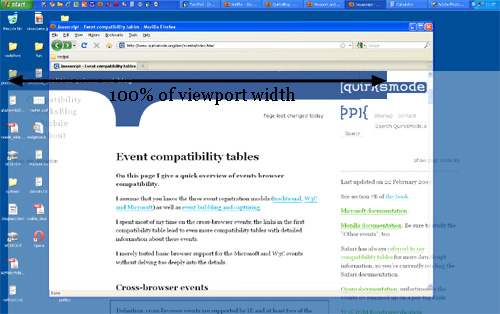

**document width? 页面宽度？**

    What I really need to know is how wide the total content of the page is, including the bits that “stick out.” As far as I know it’s not possible to find that value (well, unless you calculate the individual widths and margins of all elements on the page, but that’s error-prone, to put it mildly).

我真正需要知道的是页面中全部内容的宽度是多少，包括那些「伸出」的部分。据我所知得到这个值是不可能的（好吧，除非你去计算页面上所有元素的宽度和边距，但是委婉的说，这是容易出错的）。

    I am starting to believe that we need a JavaScript property pair that gives what I’ll call the “document width” (in CSS pixels, obviously).

我开始相信我们需要一个我称其为「文档宽度」(document width，很显然用CSS像素进行度量)的JavaScript属性对。


    And if we’re really feeling funky, why not also expose this value to CSS? I’d love to be able to make the width: 100% of my blue bar dependent on the document width, and not the <html> element’s width. (This is bound to be tricky, though, and I wouldn’t be surprised if it’s impossible to implement.)
    
并且如果我们真的如此时髦，为什么不把这个值引入到CSS中？我将会给我的蓝色边栏设置width:100%，此值基于文档宽度，而不是<html>元素的宽度。（但是这个很复杂，并且如果不能实现我也不会感到惊讶。）

    Browser vendors, what do you think?

浏览器厂商们，你们怎么认为的？


**Measuring the viewport 度量viewport**

```
document. documentElement. clientWidth/Height
* Meaning:Viewport dimensions
* Measured in:CSS pixels
* Browser errors:None
```

document. documentElement. clientWidth/Height
* 意义：Viewport尺寸。
* 度量单位：CSS像素。
* 浏览器错误：无。
 


    You might want to know the dimensions of the viewport. They can be found in document.documentElement.clientWidth and -Height.

你可能想知道viewport的尺寸。它们可以通过document.documentElement.clientWidth和-Height得到。


    If you know your DOM, you know that document.documentElement is in fact the <html> element: the root element of any HTML document. However, the viewport is one level higher, so to speak; it’s the element that contains the <html> element. That might matter if you give the <html> element a width. (I don’t recommend that, by the way, but it’s possible.)

如果你了解DOM，你应该知道document.documentElement实际上指的是<html>元素：即任何HTML文档的根元素。可以说，viewport要比它更高一层；它是包含<html>元素的元素。如果你给<html>元素设置width属性，那么这将会产生影响。（我不推荐这么做，但是那是可行的。）

    In that situation document.documentElement.clientWidth and -Height still gives the dimensions of the viewport, and not of the <html> element. (This is a special rule that goes only for this element only for this property pair. In all other cases the actual width of the element is used.)

在那种情况下document.documentElement.clientWidth和-Height给出的仍然是viewport的尺寸，而不是<html>元素的。（这是一个特殊的规则，只对这个元素的这个属性对产生作用。在任何其他的情况下，使用的是元素的实际宽度。）

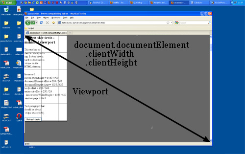

    So document.documentElement.clientWidth and -Height always gives the viewport dimensions, regardless of the dimensions of the <html> element.

所以document.documentElement.clientWidth和-Height一直代表的是viewport的尺寸，不管<html>元素的尺寸是多少。

**Two property pairs 两个属性对**

    But aren’t the dimensions of the viewport width also given by window.innerWidth/Height? Well, yes and no.

但是难道viewport宽度的尺寸也可以通过window.innerWidth/Height来提供吗？怎么说呢，模棱两可。

    There’s a formal difference between the two property pairs: document.documentElement.clientWidth and -Height doesn’t include the scrollbar, while window.innerWidth/Height does. That’s mostly a nitpick, though.

两个属性对之间存在着正式区别：document.documentElement.clientWidth和-Height并不包含滚动条，但是window.innerWidth/Height包含。这像是鸡蛋里挑骨头。

    The fact that we have two property pairs is a holdover from the Browser Wars. Back then Netscape only supported window.innerWidth/Height and IE only document.documentElement.clientWidth and -Height. Since then all other browsers started to support clientWidth/Height, but IE didn’t pick up window.innerWidth/Height.

事实上两个属性对的存在是浏览器战争的产物。当时Netscape只支持window.innerWidth/Height，IE只支持document.documentElement.clientWidth和Height。从那时起所有其他浏览器开始支持clientWidth/Height，但是IE没有支持window.innerWidth/Height。

    Having two property pairs available is a minor nuisance on desktop — but it turns out to be a blessing on mobile, as we’ll see.

在桌面环境上拥有两个属性对是有一些累赘的　－　但是就像我们将要看到的，在移动端这将会得到祝福。

**Measuring the <html> element 度量\<html>元素**

```
document. documentElement. offsetWidth/Height
* Meaning:Dimensions of the <html> element (and thus of the page).
* Measured in:CSS pixels
* Browser errors:IE measures the viewport, and not the <html> element.
```

document.documentElement.offsetWidth/Height
* 意义：元素（也就是页面）的尺寸。
* 度量单位：CSS像素。
* 浏览器错误：IE度量的是viewport，而不是元素。


    So clientWidth/Height gives the viewport dimensions in all cases. But where can we find the dimensions of the <html> element itself? They’re stored in document.documentElement.offsetWidth and -Height.

所以clientWidth/Height在所有情况下都提供viewport的尺寸。但是我们去哪里获取<html>元素本身的尺寸呢？它们存储在document.documentElement.offsetWidth和-Height之中。

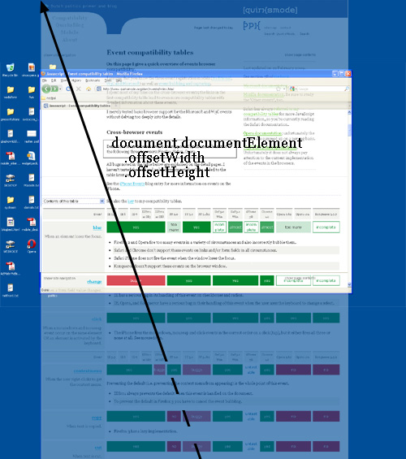

    These properties truly give you access to the <html> element as a block-level element; if you set a width, offsetWidth will reflect it.
  
这些属性可以使你以块级元素的形式访问<html>元素；如果你设置width，那么offsetWidth将会表示它。


**Event coordinates 事件中的坐标**

```
pageX/Y, clientX/Y, screenX/Y
* Meaning:see main text
* Measured in:see main text
* Browser errors:IE doesn’t support pageX/Y.IE and Opera calculate screenX/Y in CSS pixels.
```

pageX/Y, clientX/Y, screenX/Y
* 意义：见正文。
* 度量单位：见正文。
* 浏览器错误：IE不支持pageX/Y。IE和Opera以CSS像素为单位计算screenX/Y。


    Then there are the event coordinates. When a mouse event occurs, no less than five property pairs are exposed to give you information about the exact place of the event. For our discussion three of them are important:
    1. pageX/Y gives the coordinates relative to the <html> element in CSS pixels.
    2. clientX/Y gives the coordinates relative to the viewport in CSS pixels.
    3. screenX/Y gives the coordinates relative to the screen in device pixels.
    
然后是事件中的坐标。当一个鼠标事件发生时，有不少于五种属性对可以给你提供关于事件位置的信息。对于我们当前的讨论来说它们当中的三种是重要的：

pageX/Y提供了相对于<html>元素的以CSS像素度量的坐标。


clientX/Y提供了相对于viewport的以CSS像素度量的坐标。


screenX/Y提供了相对于屏幕的以设备像素进行度量的坐标。

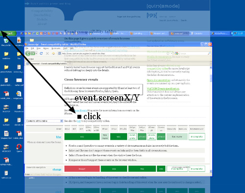

    You’ll use pageX/Y 90% of the time; usually you want to know the event position relative to the document. The other 10% of the time you’ll use clientX/Y. You never ever need to know the event coordinates relative to the screen.
    
90%的时间你将会使用pageX/Y；通常情况下你想知道的是相对于文档的事件坐标。其他的10%时间你将会使用clientX/Y。你永远不需要知道事件相对于屏幕的坐标。

**Media queries 媒体查询**

```
Media queries
* Meaning:see main text
* Measured in:see main text
* Browser errors:IE doesn’t support them.
    * For device-width/height Firefox uses the values screen.width/height would have if they are measured in CSS pixels.
    * For width/height Safari and Chrome use the values documentElement .clientWidth/Height would have if they are measured in device pixels.
```

Media queries
* 意义：见正文。
* 度量单位：见正文。
* 浏览器错误：IE不支持它们。
    * 如果 device-width/height是以CSS像素进行度量的，那么Firefox将会使用screen.width/height的值。
    * 如果width/height是以设备像素进行度量的，那么Safari和Chrome将会使用documentElement.clientWidth/Height的值。
    


    Finally, some words about media queries. The idea is very simple: you can define special CSS rules that are executed only if the width of the page is larger than, equal to, or smaller than a certain size. For instance:

```
div.sidebar {
    width: 300px;
}

@media all and (max-width: 400px) {
    // styles assigned when width is smaller than 400px;
    div.sidebar {
        width: 100px;
    }

}
```

最后，说说关于媒体查询的事。原理很简单：你可以声明「只在页面宽度大于，等于或者小于一个特定尺寸的时候才会被执行」的特殊的CSS规则。比如：
```
div.sidebar {
    width: 300px;
}

@media all and (max-width: 400px) {
    // styles assigned when width is smaller than 400px;
    div.sidebar {
        width: 100px;
    }

}
```

    Now the sidebar is 300px wide, except when the width is smaller than 400px, in which case the sidebar becomes 100px wide.

当前sidebar是300px宽，除了当宽度小于400px的时候，在那种情况下sidebar变得100px宽。

    The question is of course: which width are we measuring here?

问题很显然：我们这儿度量的是哪个宽度？

    There are two relevant media queries: width/height and device-width/device-height.
    1. width/height uses the same values as documentElement .clientWidth/Height (the viewport, in other words). It works with CSS pixels.
    2. device-width/device-height uses the same values as screen.width/height (the screen, in other words). It works with device pixels.


这儿有两个对应的媒体查询：width/height和device-width/device-height。
1. width/height使用和documentElement .clientWidth/Height（换句话说就是viewport宽高）一样的值。它是工作在CSS像素下的。
2. device-width/device-height使用和screen.width/height（换句话说就是屏幕的宽高）一样的值。它工作在设备像素下面。

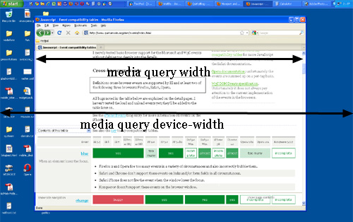

    Which should you use? That’s a no-brainer: width, of course. Web developers are not interested in the device width; it’s the width of the browser window that counts.
    
你应该使用哪个？这还用想？当然是width。Web开发者对设备宽度不感兴趣；这个是浏览器窗口的宽度。

    So use width and forget device-width — on desktop. As we’ll see, the situation is much more messy on mobile.

所以在桌面环境下去使用width而去忘记device-width吧。我们即将看到这个情况在移动端会更加麻烦。


**Conclusion 总结**

    That concludes our foray into the desktop browsers’ behaviour. The second part of this series ports these concepts to mobile and highlights some important differences with the desktop.

本文总结了我们对桌面浏览器行为的探寻。这个系列的第二部分把这些概念指向了移动端，并显示的指出了与桌面环境上的一些重要区别。


两个viewport的故事第二部分
------------------------------

    In this mini-series I will explain how viewports and the widths of various important elements work, such as the <html> element, as well as the window and the screen.
    
在这个迷你系列的文章里边我将会解释viewport，以及许多重要元素的宽度是如何工作的，比如<html>元素，也包括窗口和屏幕。

    On this page we’re going to talk about the mobile browsers. If you’re totally new to mobile I advise you to read part one about the desktop browsers first, in order to set the stage in a familiar environment.
    
这篇文章我们来聊聊关于移动浏览器的内容。如果你对移动开发完全是一个新手的话，我建议你先读一下第一篇关于桌面浏览器的文章，先在熟悉的环境中进行下热身。

**The problem of mobile browsers Conclusion 移动浏览器的问题**

    When we compare the mobile browsers to the desktop ones, the most obvious difference is screen size. Mobile browsers display significantly less of a desktop-optimised website than desktop browsers; either by zooming out until the text is unreadably small, or by showing only the small part of the site that fits in the screen.

当我们比较移动浏览器和桌面浏览器的时候，它们最显而易见的不同就是屏幕尺寸。为桌面浏览器所设计的网站在移动浏览器中显示的内容明显要少于在桌面浏览器中显示的；不管是对其进行缩放直到文字小得无法阅读，还是在屏幕中以合适的尺寸只显示站点中的一小部分内容。

    A mobile screen is far smaller than a desktop screen; think about 400px wide at maximum, and sometimes a lot less. (Some phones report larger widths, but they’re lying — or at the very least giving us useless information.)
    
移动设备的屏幕比桌面屏幕要小得多；想想其最大有400px宽，有时候会小很多。（一些手机声称拥有更大的宽度，但是它在撒谎－或者也可以说它给我们提供了没用的信息。）

    An intermediate layer of tablet devices such as the iPad or the rumoured HP webOS-based one will bridge the gap between desktop and mobile, but that doesn’t change the fundamental problem. Sites must work on mobile devices, too, so we have to get them to display well on a small screen.

平板设备中的像素中间层会在桌面环境和移动环境的缺口之间架起一段桥梁，比如像iPad或者传说中HP基于webOS所研发的设备，但是这并没有改变根本问题。站点必须也能在移动设备上工作，所以我们不得不让它们能在小尺寸的屏幕上正常显示。

    The most important problems center on CSS, especially the dimensions of the viewport. If we’d copy the desktop model one-to-one, our CSS would start to misfire horrendously.
    
最重要的问题在CSS上，特别是viewport的尺寸。如果我们照搬桌面环境的模式，那么我们的CSS就要立马熄火了（译者：即显示混乱）。

    Let’s go back to our sidebar with width: 10%. If mobile browsers would do exactly the same as desktop browsers, they’d make the element about 40px wide at most, and that’s far too narrow. Your liquid layout would look horribly squashed.
    
让我们看下之前sidebar为width: 10%的例子。如果移动浏览器想要实现跟桌面浏览器一样的行为，它们最多为元素设置40px的宽度，但是这太窄了。你的流式布局会看起来被挤乱了。

    One way of solving the problem is building a special website for mobile browsers. Even apart from the fundamental question of whether you should do that at all, the practical problem is that only very few site owners are sufficiently clued-in to cater specifically to mobile devices.

解决这个问题的一个方法是为移动浏览器建立一个特定的站点。先抛开你是否有必要这么做这个基本问题，而实际的情况是只有很少的网站拥有者真正知道要对移动设备做特殊的处理。

    Mobile browser vendors want to offer their clients the best possible experience, which right now means “as much like desktop as possible.” Hence some sleight of hand was necessary.

移动浏览器厂商想给它们的客户尽可能的提供最好的体验，这现在指的就是「尽可能的跟桌面一样」。因此耍一些花招是必要的。

**The two viewports 两个viewport**

    So the viewport is too narrow to serve as a basis for your CSS layout. The obvious solution is to make the viewport wider. That, however, requires it to be split into two: the visual viewport and the layout viewport.

viewport太窄了，以至于不能正常展示你的CSS布局。明显的解决方案是使viewport变宽一些。无论如何，需要把它分成两部分：visual viewport和layout viewport。

    George Cummins explains the basic concept best here at Stack Overflow:
    Imagine the layout viewport as being a large image which does not change size or shape. Now image you have a smaller frame through which you look at the large image. The small frame is surrounded by opaque material which obscures your view of all but a portion of the large image. The portion of the large image that you can see through the frame is the visual viewport. You can back away from the large image while holding your frame (zoom out) to see the entire image at once, or you can move closer (zoom in) to see only a portion. You can also change the orientation of the frame, but the size and shape of the large image (layout viewport) never changes.
    See also this explanation by Chris.

George Cummins在Stack Overflow上对基本概念给出了最佳解释：
    把layout viewport想像成为一张不会变更大小或者形状的大图。现在想像你有一个小一些的框架，你通过它来看这张大图。（译者：可以理解为「管中窥豹」）这个小框架的周围被不透明的材料所环绕，这掩盖了你所有的视线，只留这张大图的一部分给你。你通过这个框架所能看到的大图的部分就是visual viewport。当你保持框架（缩小）来看整个图片的时候，你可以不用管大图，或者你可以靠近一些（放大）只看局部。你也可以改变框架的方向，但是大图（layout viewport）的大小和形状永远不会变。
    也看一下Chris给出的解释。
    

    The visual viewport is the part of the page that’s currently shown on-screen. The user may scroll to change the part of the page he sees, or zoom to change the size of the visual viewport.
    
visual viewport是页面当前显示在屏幕上的部分。用户可以通过滚动来改变他所看到的页面的部分，或者通过缩放来改变visual viewport的大小。


    However, the CSS layout, especially percentual widths, are calculated relative to the layout viewport, which is considerably wider than the visual viewport.
    
无论怎样，CSS布局，尤其是百分比宽度，是以layout viewport做为参照系来计算的，它被认为要比visual viewport宽。

    Thus the <html> element takes the width of the layout viewport initially, and your CSS is interpreted as if the screen were significantly wider than the phone screen. This makes sure that your site’s layout behaves as it does on a desktop browser.
    
所以<html>元素在初始情况下用的是layout viewport的宽度，并且你的CSS是在屏幕（译者注：宽度等于layout
viewport的虚拟屏幕）好像明显比电话屏幕宽（物理屏幕）要宽的假设基础上进行解释的。这使得你站点布局的行为与其在桌面浏览器上的一样。

    How wide is the layout viewport? That differs per browser. Safari iPhone uses 980px, Opera 850px, Android WebKit 800px, and IE 974px.

layout viewport有多宽？每个浏览器都不一样。Safari iPhone为980px，Opera为850px，Android WebKit为800px，最后IE为974px。

```
Some browsers have special behaviour:
* Symbian WebKit tries to keep the layout viewport equal to the visual viewport, and yes, that means that elements with a percentual width may behave oddly. However, if the page doesn’t fit into the visual viewport due to absolute widths the browser stretches up the layout viewport to a maximum of 850px.
* Samsung WebKit (on bada) makes the layout viewport as wide as the widest element.
* On BlackBerry the layout viewport equals the visual viewport at 100% zoom. This does not change.
```

一些浏览器有特殊的行为：
* Symbian WebKit会保持layout viewport与visualviewport相等，是的，这意味着拥有百分比宽度元素的行为可能会比较奇怪。但是，如果页面由于设置了绝对宽度而不能放入visual viewport中，那么浏览器会把layout viewport拉伸到最大850px宽。
* Samsung WebKit (on bada)使layout viewport和最宽的元素一样宽。
* 在BlackBerry上，layout viewport在100%缩放比例的情况下等于visual viewport。这不会变。 

**Zooming 缩放**

    Both viewports are measured in CSS pixels, obviously. But while the visual viewport dimensions change with zooming (if you zoom in, less CSS pixels fit on the screen), the layout viewport dimensions remain the same. (If they didn’t your page would constantly reflow as percentual widths are recalculated.)
    
很显然两个viewport都是以CSS像素度量的。但是当进行缩放（如果你放大，屏幕上的CSS像素会变少）的时候，visual viewport的尺寸会发生变化，layout viewport的尺寸仍然跟之前的一样。（如果不这样，你的页面将会像百分比宽度被重新计算一样而经常被重新布局。）

**Understanding the layout viewport 理解layout viewport**

    In order to understand the size of the layout viewport we have to take a look at what happens when the page is fully zoomed out. Many mobile browsers initially show any page in fully zoomed-out mode.
    
为了理解layout viewport的尺寸，我们不得不看一下当页面被完全缩小后会发生什么。许多移动浏览器会在初始情况下以完全缩小的模式来展示任何页面。

    The point is: browsers have chosen their dimensions of the layout viewport such that it completely covers the screen in fully zoomed-out mode (and is thus equal to the visual viewport).

重点是：浏览器已经为自己的layout viewport选择了尺寸，这样的话它在完全缩小模式的情况下完整的覆盖了屏幕（并且等于visual viewport）。


    Thus the width and the height of the layout viewport are equal to whatever can be shown on the screen in the maximally zoomed-out mode. When the user zooms in these dimensions stay the same.
    
所以layout viewport的宽度和高度等于在最大限度缩小的模式下屏幕上所能显示的任何内容的尺寸。当用户放大的时候这些尺寸保持不变。


    The layout viewport width is always the same. If you rotate your phone, the visual viewport changes, but the browser adapts to this new orientation by zooming in slightly so that the layout viewport is again as wide as the visual viewport.

layout viewport宽度一直是一样的。如果你旋转你的手机，visual viewport会发生变化，但是浏览器通过轻微的放大来适配这个新的朝向，所以layout viewport又和visual viewport一样宽了。


    This has consequences for the layout viewport’s height, which is now substantially less than in portrait mode. But web developers don’t care about the height, only about the width.

这对layout viewport的高度会有影响，现在的高度比肖像模式（竖屏）要小。但是web开发者不在乎高度，只在乎宽度。


【Measuring the layout viewport 度量layout viewport】

    We now have two viewports that we want to measure. Therefore it’s very lucky that the Browser Wars gave us two property pairs.

我们现在有两个需要度量的viewport。很幸运的是浏览器战争给我们提供了两个属性对。

    document.documentElement.clientWidth and -Height contain the layout viewport’s dimensions.

document.documentElement.clientWidth和-Height包含了layout viewport的尺寸。

document. documentElement. clientWidth/Height
* Meaning:Layout viewport dimensions
* Measured in:CSS pixels
* Full support:Opera, iPhone, Android, Symbian, Bolt, MicroB, Skyfire, Obigo
* Problems:Visual viewport dimensions in Iris
    * Samsung WebKit reports the correct values when a <meta viewport> tag is applied to the page; the dimensions of the <html> element otherwise.
    * Screen dimensions in device pixels in Firefox
    * IE returns 1024x768. However, it stores the information in document.body.clientWidth/Height. This is consistent with IE6 desktop.
    * NetFront’s values are only correct at 100% zoom.
    * Symbian WebKit 1 (older S60v3 devices) does not support these properties.
* Not supported:BlackBerry

document.documentElement.clientWidth/Height
* 意义：Layout viewport的尺寸
* 度量单位：CSS像素
* 完全支持Opera, iPhone, Android, Symbian, Bolt, MicroB, Skyfire, Obigo。
* 在Iris中Visual viewport有问题
    * Samsung WebKit在页面应用了<meta viewport>标签的时候会返回正确的值；否则使用<html>元素的尺寸。
    * Firefox返回以设备像素为单位的屏幕尺寸。
    * IE返回1024x768。然而，它把信息存储在document.body.clientWidth/Height中。这和桌面的IE6是一致的。
    * NetFront的值只在100%缩放比例的情况下是正确的。
    * Symbian WebKit 1 (老的S60v3设备)不支持这些属性。
* BlackBerry不支持。

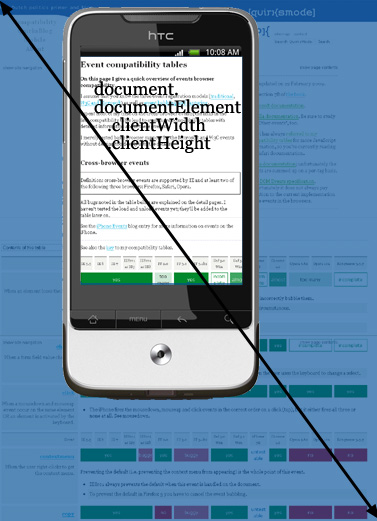

    The orientation matters for the height, but not for the width.

朝向会对高度产生影响，但对宽度不会产生影响。

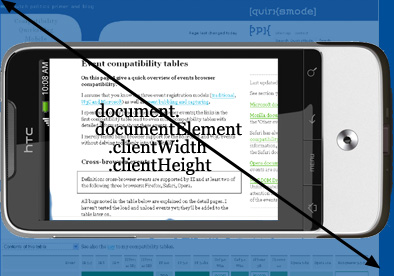


**Measuring the visual viewport 度量visual viewport**

    As to the visual viewport, it is measured by window.innerWidth/Height. Obviously the measurements change when the user zooms out or in, since more or fewer CSS pixels fit into the screen.
    
对于visual viewport，它是通过window.innerWidth/Height来进行度量的。很明显当用户缩小或者放大的时候，度量的尺寸会发生变化，因为屏幕上的CSS像素会增加或者减少。

window.innerWidth/Height
* Meaning:Visual viewport dimensions
* Measured in:CSS pixels
* Full support:iPhone, Symbian, BlackBerry
* Problems:Opera and Firefox return the screen width in device pixels.
    * Android, Bolt, MicroB, and NetFront return the layout viewport dimensions in CSS pixels.
* Not supported:IE, but it gives the visual viewport dimension in document. documentElement. offsetWidth/Height.
    * Samsung WebKit reports either the dimensions of the layout viewport or of the <html>, depending on whether a <meta viewport> tag has been applied to the page or not.
* Gibberish:Iris, Skyfire, Obigo

window.innerWidth/Height
* 意义：Visual viewport的尺寸。
* 度量单位：CSS像素。
* 完全支持iPhone，Symbian，BlackBerry。
* 问题:Opera和Firefox返回以设备像素为单位的屏幕宽度。
    * Android，Bolt，MicroB和NetFront返回以CSS像素为单位的layout viewport尺寸。
* 不支持IE，但是它在document.documentElement.offsetWidth/Height中提供visual viewport的尺寸。
    * Samsung WebKit返回的是layout viewport或者<html>的尺寸，这取决于页面是否应用了<meta viewport>标签。
* Iris，Skyfire，Obigo根本就是扯淡。

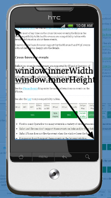

    Unfortunately this is an area of incompatibilities; many browsers still have to add support for the measurement of the visual viewport. Still, no browser stores this measurment in any other property pair, so I guess window.innerWidth/Height is a standard, albeit a badly supported one.
    
不幸的是这是浏览器不兼容问题中的一部分；许多浏览器仍然不得不增加对visualviewport度量尺寸的支持。但是没有浏览器把这个度量尺寸存放任何其他的属性对中，所以我猜window.innerWidth/Height是标准，尽管它被支持的很糟。

**The screen 屏幕**

    As on desktop, screen.width/height give the screen size, in device pixels. As on the desktop, you never need this information as a web developer. You’re not interested in the physical size of the screen, but in how many CSS pixels currently fit on it.
    
像桌面环境一样，screen.width/height提供了以设备像素为单位的屏幕尺寸。像在桌面环境上一样，做为一个开发者你永远不需要这个信息。你对屏幕的物理尺寸不感兴趣，而是对屏幕上当前有多少CSS像素感兴趣。

screen.width and screen.height
* Meaning:Screen size
* Measured in:Device pixels
* Full support:Opera Mini, Android, Symbian, Iris, Firefox, MicroB, IE, BlackBerry
* Problems:Opera Mobile on Windows Mobile only gives the landscape size. Opera Mobile on S60 gets it right.
    * Samsung WebKit reports either the dimensions of the layout viewport or of the <html>, depending on whether a <meta viewport> tag has been applied to the page or not.
    * iPhone and Obigo only give portrait sizes.
    * NetFront only gives landscape sizes.
* Gibberish:Bolt, Skyfire

screen.width and screen.height
* 意义：屏幕尺寸
* 度量单位：设备像素
* 完全支持Opera Mini，Android，Symbian，Iris，Firefox，MicroB，IE，BlackBerry。
* 问题：Windows Mobile上的Opera Mobile只提供了风景模式（横屏）的尺寸。S60上的Opera Mobile返回的值是正确的。
    * Samsung WebKit返回layout viewport或者<html>的尺寸，这取决于是否在页面上应用了<meta viewport>标签。
    * iPhone和Obigo只提供了肖像模式（竖屏）的尺寸。
    * NetFront只提供风景模式（横屏）的尺寸。
*Bolt，Skyfire依旧在扯淡。

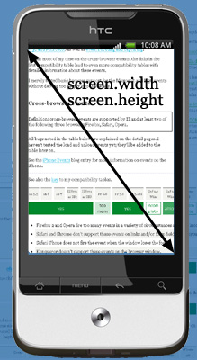

**The zoom level 缩放比例 zoom level**

    Reading out the zoom level directly is not possible, but you can get it by dividing screen.width by window.innerWidth. Of course that only works if both properties are perfectly supported.

直接读出缩放比例是不可能的，但是你可以通过以screen.width除以window.innerWidth来获取它的值。当然这只有在两个属性都被完美支持的情况下才有用。

    Fortunately the zoom level is not important. What you need to know is how many CSS pixels currently fit on the screen. And you can get that information from window.innerWidth — if it’s supported correctly.

幸运的是缩放比例并不太重要。你需要知道的是当前屏幕上有多少个CSS像素。你可以通过window.innerWidth来获取这个信息，如果它被正确支持的话。


**Scrolling offset 滚动距离Scrolling offset**

    What you also need to know is the current position of the visual viewport relative to the layout viewport. This is the scrolling offset, and, just as on desktop, it’s stored in window.pageX/YOffset.
    
你还需知道的是visual viewport当前相对于layout viewport的位置。这是滚动距离，并且就像在桌面一样，它被存储在window.pageX/YOffset之中。

window.pageX/YOffset
* Meaning:Scrolling offset; which is the same as the visual viewport’s offset relative to the layout viewport.
* Measured in:CSS pixels
* Full support:iPhone, Android, Symbian, Iris, MicroB, Skyfire, Obigo.
* Problems:Opera, Bolt, Firefox, and NetFront always return 0.
    * Samsung WebKit reports correct values only if a <meta viewport> is applied to the page.
* Not supported:IE, BlackBerry. IE stores the values in document. documentElement. scrollLeft / Top

window.pageX/YOffset
* 意义：滚动距离；与visual viewport相对于layout viewport的距离一样。
* 度量单位：CSS像素
* 完全支持iPhone，Android，Symbian，Iris，MicroB，Skyfire，Obigo。
* 问题：Opera，Bolt，Firefox和NetFront一直返回0。
    * Samsung WebKit只有当<meta viewport>被应用到页面上时候才返回正确的值。
* 不支持IE，BlackBerry。IE把值存在document.documentElement.scrollLeft/Top之中。


**<html> element \<html> 元素**

    Just as on desktop, document.documentElement.offsetWidth/Height gives the total size of the <html> element in CSS pixels.

就像在桌面上一样，document.documentElement.offsetWidth/Height提供了以CSS像素为单位的<html>元素的整个尺寸。

document. documentElement. offsetWidth / Height
* Meaning:Total size of the <html> element.
* Measured in:CSS pixels
* Full support:Opera, iPhone, Android, Symbian, Samsung, Iris, Bolt, Firefox, MicroB, Skyfire, BlackBerry, Obigo.
* Problems:NetFront’s values are only correct at 100% zoom.
    * IE uses this propery pair to store the dimensions of the visual viewport. In IE, see document. body. clientWidth/Height for the correct values.

document.documentElement.offsetWidth/Height
* 意义：<html>元素的整体尺寸。
* 度量单位：CSS像素。
* 完全支持Opera，iPhone，Android，Symbian，Samsung，Iris，Bolt，Firefox，MicroB，Skyfire，BlackBerry，Obigo。
* 问题：NetFront的值只在100%缩放比例的情况下才正确。
    * IE使用这个属性对来存储visual viewport的尺寸。在IE中，去document.body.clientWidth/Height中获取正确的值。


**Media queries 媒体查询Media queries**

    Media queries work the same as on desktop. width/height uses the layout viewport as its reference and is measured in CSS pixels, device-width/height uses the device screen and is measured in device pixels.
    
媒体查询和其在桌面环境上的工作方式一样。width/height使用layout　viewport做为参照物，并且以CSS像素进行度量，device-width/height使用设备屏幕，并且以设备像素进行度量。

    In other words, width/height mirrors the values of document. documentElement. clientWidth/Height, while device-width/height mirrors the values of screen.width/height. (They actually do so in all browsers, even if the mirrored values are incorrect.)

换句话说，width/height是document.documentElement.clientWidth/Height值的镜像，同时device-width/height是screen.width/height值的镜像。（它们在所有浏览器中实际上就是这么做的，即使这个镜像的值不正确。）

Media queries
* Meaning:Measure <html> element width (CSS pixels) or device width (device pixels).
* Full support:Opera, iPhone, Android, Symbian, Samsung, Iris, Bolt, Firefox, MicroB.
* Not supported:Skyfire, IE, BlackBerry, NetFront, Obigo.
* Note:What I test here is whether the browsers take their data from the correct property pairs. Whether these property pairs give correct information is not part of this particular test.

媒体查询
* 意义：度量<html>元素的宽度（CSS像素）或者设备宽度（设备像素）。
* 完全支持Opera，iPhone，Android，Symbian，Samsung，Iris，Bolt，Firefox，MicroB。
* 不支持Skyfire，IE，BlackBerry，NetFront，Obigo。
* 注意我在这里测试的是浏览器是否能从正确的「属性对」获取它们的数据。这些属性对是否提供正确的信息不是这个测试的一部分。

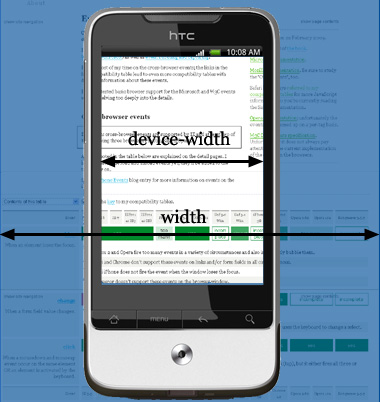

    Now which measurement is more useful to us web developers? Point is, I don’t know.

现在哪个度量的尺寸对web开发者更有用？我的观点是，不知道。

    I started out thinking that the device-width was the most important one, since it gives us some information about the device that we might be able to use. For instance, you could vary the width of your layout to accomodate the width of the device. However, you could also do that by using a <meta viewport>; it’s not absolutely necessary to use the device-width media query.

我开始认为device-width是最重要的那一个，因为它给我们提供了关于我们可能会使用的设备的一些信息。比如，你可以根据设备的宽度来更改你的布局的宽度。不过，你也可以使用<meta viewport>来做这件事情；使用device-width媒体查询并不是绝对必要的。

    So is width the more important media query after all? Maybe; it gives some clue as to what the browser vendor thinks is a good width for a website on this device. But that’s rather vague, and the width media query doesn’t really give any other information.

那么width究竟是不是更重要的媒体查询呢？可能是；它提供了某些线索，这些线索是关于浏览器厂商认为在这个设备上网站应该有的正确宽度。但是这有些模糊不清，并且width媒体查询实际上不提供任何其他信息。

    So I’m undecided. For the moment I think that media queries are important to figure out whether you’re on a desktop, a tablet, or a mobile device, but not so very useful for distinguishing between the various tablet or mobile devices.

所以我不做选择。目前我认为媒体查询在分辨你是否在使用桌面电脑，平板，或者移动设备方面很重要，但是对于区分各种平板或者移动设备并没有什么用。

    Or something.

或者还有其他用处。

**Event coordinates 事件坐标**

    Event coordinates work more or less as on desktop. Unfortunately, of the twelve tested browsers only two, Symbian WebKit and Iris, get all three exactly right. All other browsers have more or less serious problems.

这里的事件坐标与其在桌面环境上的工作方式差不多。不幸的是，在十二个测试过的浏览器中只有Symbian WebKit和Iris这两个浏览器能获取到三个完全正确的值。其他所有浏览器都或多或少有些严重的问题。

    pageX/Y is still relative to the page in CSS pixels, and this is by far the most useful of the three property pairs, just as it is on desktop.
    
pageX/Y仍然是相对于页面，以CSS像素为单位，并且它是目前为止三个属性对中最有用的，就像它在桌面环境上的那样。

Event coordinates
* Meaning:See main text.
* Measured in:See main text.
* Full support:Symbian, Iris
* Problems:Opera Mobile gives pageX/Y in all three property pairs, but something goes wrong when you scroll a lot.
    * On iPhone, Firefox, and BlackBerry clientX/Y is equal to pageX/Y
    * On Android and MicroB screenX/Y is equal to clientX/Y (in CSS pixels, in other words)
    * On Firefox screenX/Y is wrong.
    * IE, BlackBerry, and Obigo don’t support pageX/Y.
    * In NetFront all three are screenX/Y.
    * In Obigo clientX/Y is screenX/Y.
    * Samsung WebKit always reports pageX/Y.
* Not tested in:Opera Mini, Bolt, Skyfire

Event coordinates
* 意义：见正文
* 度量单位：见正文
* 完全支持Symbian，Iris
* 问题：Opera Mobile在三个属性对中提供的都是pageX/Y的值，但是当你滚动一段距离后就出问题了。
    * 在iPhone，Firefox和BlackBerry上clientX/Y等于pageX/Y。
    * 在Android和MicroB上screenX/Y等于clientX/Y（换句话说，也就是以CSS像素为单位）。
    * 在Firefox上screenX/Y是错的。
    * IE，BlackBerry和Obigo不支持pageX/Y。
    * 在NetFront上三个属性对的值都等于screenX/Y。
    * 在Obigo上clientX/Y等于screenX/Y。
    * Samsung WebKit一直返回pageX/Y。
* 没有在Opera Mini，Bolt，Skyfire上测试过。


    clientX/Y is relative to the visual viewport in CSS pixels. This makes sense, although I’m not entirely certain what it’s good for.
    
 clientX/Y是相对于visual viewport来计算，以CSS像素为单位的。这有道理的，即使我还不能完全指出这么做的好处。  

    screenX/Y is relative to the screen in device pixels. Of course, this is the same reference that clientX/Y uses, and device pixels are useless. So we do not need to worry about screenX/Y; it’s every bit as useless as on desktop.
    
screenX/Y是相对于屏幕来计算，以设备像素为单位。当然，这和clientX/Y用的参照系是一样的，并且设备像素在这没有用处。所以我们不需要担心screenX/Y；跟在桌面环境上一样没有用处。


**Meta viewport viewport meta标签**

Meta viewport
* Meaning:Set the layout viewport’s width.
* Measured in:CSS pixels
* Full support:Opera Mobile, iPhone, Android, Iris, IE, BlackBerry, Obigo
* Not supported:Opera Mini, Symbian, Bolt, Firefox, MicroB, NetFront
* Problems:Skyfire can’t handle my test page.
    * If the <meta viewport> is applied to the page in Samsung WebKit, several other properties change meaning.
    * Opera Mobile, iPhone, Samsung, and BlackBerry do not allow the user to zoom out.

Meta viewport
* 意义：设置layout viewport的宽度。
* 度量单位：CSS像素。
* 完全支持Opera Mobile，iPhone，Android，Iris，IE，BlackBerry，Obigo。
* 不支持Opera Mini，Symbian，Bolt，Firefox，MicroB，NetFront。
* 问题：Skyfire不能处理我的测试页面。
    * 如果在Samsung WebKit中对页面应用<meta viewport>，一些其他属性的意义会发生变化。
    * Opera Mobile，iPhone，Samsung和BlackBerry不允许用户进行缩小。


    Finally, let’s discuss the <meta name="viewport" content="width=320">; originally an Apple extension but meanwhile copied by many more browsers. It is meant to resize the layout viewport. In order to understand why that’s necessary, let’s take one step back.

最后，让我们讨论一下<meta name="viewport"content="width=320">；起初它是苹果做的一个扩展，但是与此同时被更多的浏览器所借鉴。它的意思是调整layout viewport的大小。为了理解为什么这么做是必要的，让我们后退一步。

    Suppose you build a simple page and give your elements no width. Now they stretch up to take 100% of the width of the layout viewport. Most browsers zoom out to show the entire layout viewport on the screen, giving an effect like this:

假设你创建了一个简单的页面，并且没有给你的元素设置「宽度」。那么现在它们会被拉伸来填满layout viewport宽度的100%。大部分浏览器会进行缩放从而在屏幕上展示整个layout viewport，产生下面这样的效果：


    All users will immediately zoom in, which works, but most browsers keep the width of the elements intact, which makes the text hard to read.
    
所有用户将会立刻进行放大操作，这个是工作的，但是大部分浏览器完好无缺的保持元素的宽度，这使得文字很难阅读。    
    
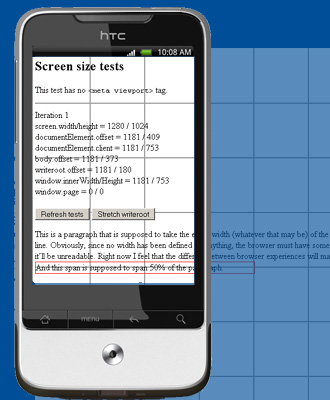

    (The significant exception here is Android WebKit, which actually reduces the size of text-containing elements so that they fit on the screen. This is absolutely brilliant, and I feel all other browsers should copy this behaviour. I will document it fully later.)

（值得注意的例外是Android WebKit，它实际上会减小包含文字的元素的大小，所以文字就能适配屏幕。这简直太有才了，我觉得所有其他浏览器应该借鉴这个行为。我过阵子将会完整的写一下这个议题。）

    Now what you could try is setting html {width: 320px}. Now the <html> element shrinks, and with it all other elements, which now take 100% of 320px. This works when the user zooms in, but not initially, when the user is confronted with a zoomed-out page that mostly contains nothing.

现在你应该尝试设置html {width: 320px}。现在<html>元素收缩了，并且其他元素现在使用的是320px的100%。这在用户进行放大操作的时候有用，但是在初始状态是没用的，当用户面对一个缩小了的页面这几乎不包含任何内容。

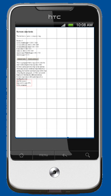

    It is in order to get around this problem that Apple invented the meta viewport tag. When you set <meta name="viewport" content="width=320"> you set the width of the layout viewport to 320px. Now the initial state of the page is also correct.
    
为了绕开这个问题苹果发明了viewport　meta标签。当你设置<meta name="viewport" content="width=320">的时候，你就设置了layout viewport的宽度为320px。现在页面的初始状态也是正确的。


    You can set the layout viewport’s width to any dimension you want, including device-width. That last one takes screen.width (in device pixels) as its reference and resizes the layout viewport accordingly.

你可以把layout viewport的宽度设置为任何你想要的尺寸，包括device-width。device-width会把screen.width（以设备像素为单位）做为其值，并相应的重置layout viewport的尺寸。

    There’s a catch here, though. Sometimes the formal screen.width does not make much sense because the pixel count is just too high. For instance, the Nexus One has a formal width of 480px, but Google engineers have decided that giving the layout viewport a width of 480px when using device-width is just too much. They shrank it to 2/3rds, so that device-width gives you a width of 320px, just as on the iPhone.

但这里有一个隐情。有时候正规的screen.width不那么明了，因为像素的数量太大了。比如，Nexus One的正规宽度是480px，但是Google的工程师们觉得当使用device-width的时候，layout viewport的宽度为480px，这有些太大了。他们把宽度缩小为三分之二，所以device-width会返回给你一个320px的宽度，就像在iPhone上一样。

    If, as is rumoured, the new iPhone will sport a larger pixel count (which does not necessarily equal a larger screen!), I wouldn’t be surprised if Apple copies this behaviour. Maybe in the end device-width will just mean 320px.
    
如果，像传闻那样，新的iPhone将会炫耀一个更大的像素数量（并不意味着一个更大的屏幕），如果苹果借鉴了这个行为我将不会感到惊讶。也许最终device-width就意味着320px。

**Related research 相关研究**  

Several related topics have to be researched further:
* position: fixed. A fixed element, as we know, is positioned relative to the viewport. But relative to which viewport?
I’ve done this research meanwhile.
* Other media queries: dpi, orientation, aspect-ratio. dpi, especially, is a disaster area, not only because all browsers report 96dpi, which is usually false, but also because I’m not yet totally sure which value is most interesting for web developers.
* What happens when an element is wider than the layout viewport/HTML element? Say I insert an element with width: 1500px into one of my test pages? The element will stick out of the HTML element (overflow: visible), but that means that the actual viewport can become wider than the layout viewport. Besides, an old Android (Nexus One) enlarged the HTML element when this happens. Is that a good idea?

一些相关的主题不得不需要进行更深一步的研究：

* position: fixed。一个固定的元素，就像我们知道的那样，是相对于viewport来进行定位的。但是相对于哪个viewport？我正在同时做这个研究。
* 其他媒体查询：dpi，orientation，aspect-ratio。尤其是dpi，那是一个灾难地区，不仅仅是因为所有浏览器都返回96dpi，通常都是错的，也是因为我完全不确定对于web开发者来说哪个值是他们最感兴趣的。
* 当一个元素比layout viewport/HTML元素宽的时候会发生什么？比如我把一个拥有width:1500px属性的元素插入到我的测试页面中的一个？这个元素将会从HTML元素中伸出来（overflow: visible），但这意味着实际的viewport可以变得比layout viewport要宽。除了这个以外，旧Android（Nexus One）还会当这个发生的时候放大HTML元素。这是个好主意吗？


